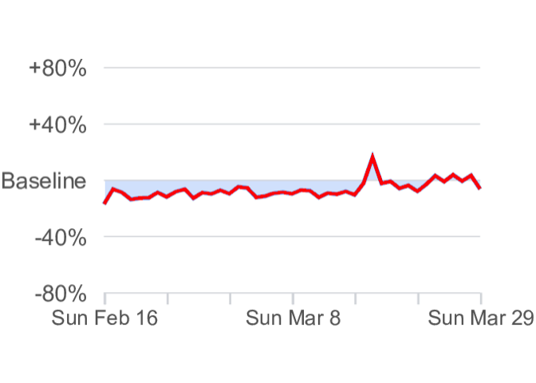
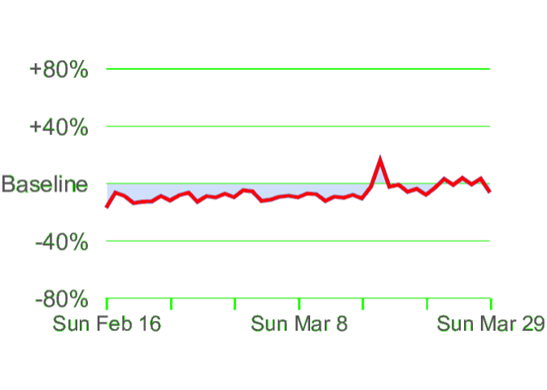
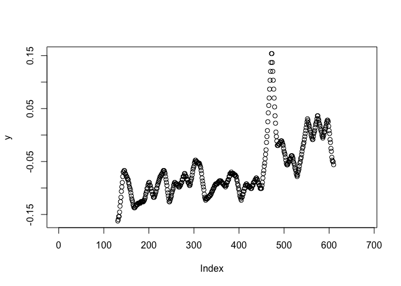
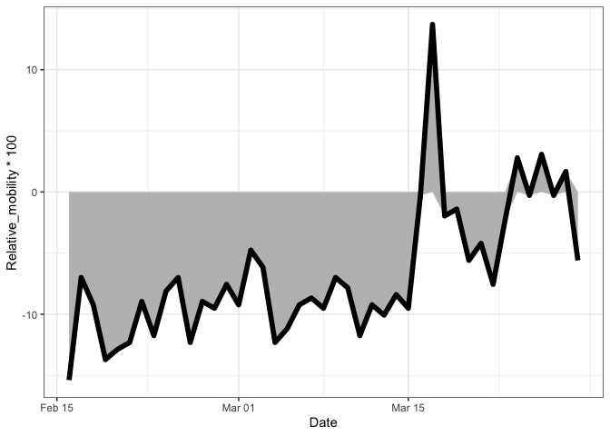

# Extracting data from google’s COVID-19 community mobility reports

Google has recently published [reports on the mobilty
data](https://www.google.com/covid19/mobility/) for different
contires/regions. However, I could not find the raw data behind the
plots. Here is my attemp to recover the raw data.

### Downloading the report and extract the data graphs

This is done using [shell commands](getdata.md).

### Process one example image in R (Grocery & pharmacy in Singapore)

Load libraries and an example image

``` r
library(grid)
library(dplyr)
library(png)
library(ggplot2)
img <- readPNG("2020-03-29_SG_Mobility_Report_en.2.png")
```

We can extract the color with a digital color meter:

  - Graph color rgb(81, 135,237) or rgb(0.32, 0.53, 0.93)
  - Grid color rgb(216, 218, 222) or rgb(0.85, 0.85, 0.87)

Find the graph

``` r
delta <- 0.08

graph.sel <- abs(img[,,1] - 0.32) < delta & abs(img[,,2] - 0.53) < delta & abs(img[,,3] - 0.93) < delta

## Validate the selection
img[,,1][graph.sel] <- 1
img[,,2][graph.sel] <- 0
img[,,3][graph.sel] <- 0

grid.raster(img[,,])
```

<!-- -->

Find the grid

``` r
delta <- 0.08
grid.sel <- abs(img[,,1] - 0.85) < delta & abs(img[,,2] - 0.85) < delta & abs(img[,,3] - 0.85) < delta

img[,,1][grid.sel] <- 0
img[,,2][grid.sel] <- 1
img[,,3][grid.sel] <- 0

grid.raster(img[,,])
```

<!-- -->

Find y
values

``` r
gridlines.y <- data.frame(rows=which(grid.sel[, round(dim(grid.sel)[2]/2)])) %>% 
    mutate(diff=rows-lag(rows)) %>% 
    filter(diff >2 | is.na(diff)) %>% 
    pull(rows)
zero <- (gridlines.y[1] + last(gridlines.y))/2
scale <- 1.6/abs(gridlines.y[1] - last(gridlines.y))

y <- (zero-apply(graph.sel,2,function(x) mean(which(x))) )* scale

# check extracted data shape
plot(y)
```

<!-- -->

Find x values

``` r
## find position of the ticks
tmp <- grid.sel[last(gridlines.y):(last(gridlines.y) + 10),] %>% colSums()

ticks.x <- data.frame(cols=which(tmp > 5)) %>% 
    mutate(diff=cols-lag(cols)) %>% 
    filter(diff >2 | is.na(diff)) %>% pull(cols) 

step <- (last(ticks.x)-ticks.x[1])/42## 43 days
x.sel <- round(seq(ticks.x[1] +1, length=43, by=step))

extracted <- data.frame(Date=seq(as.Date("2020/2/16"), as.Date("2020/3/29"), by=1),
           Relative_mobility=y[x.sel])

## You can now save this as a csv or plain text
head(extracted)
```

    ##         Date Relative_mobility
    ## 1 2020-02-16       -0.15384615
    ## 2 2020-02-17       -0.06993007
    ## 3 2020-02-18       -0.09230769
    ## 4 2020-02-19       -0.13706294
    ## 5 2020-02-20       -0.12867133
    ## 6 2020-02-21       -0.12307692

Let’s plot

``` r
ggplot(extracted, aes(x=Date, y=Relative_mobility*100)) + 
    geom_area(fill='grey') + 
    geom_line(lwd=2) + 
    theme_bw() 
```

<!-- -->

Session information

``` r
sessionInfo()
```

    ## R version 3.5.1 (2018-07-02)
    ## Platform: x86_64-apple-darwin15.6.0 (64-bit)
    ## Running under: macOS  10.15.4
    ## 
    ## Matrix products: default
    ## BLAS: /Library/Frameworks/R.framework/Versions/3.5/Resources/lib/libRblas.0.dylib
    ## LAPACK: /Library/Frameworks/R.framework/Versions/3.5/Resources/lib/libRlapack.dylib
    ## 
    ## locale:
    ## [1] en_US.UTF-8/en_US.UTF-8/en_US.UTF-8/C/en_US.UTF-8/en_US.UTF-8
    ## 
    ## attached base packages:
    ## [1] grid      stats     graphics  grDevices utils     datasets  methods  
    ## [8] base     
    ## 
    ## other attached packages:
    ## [1] ggplot2_3.2.1 png_0.1-7     dplyr_0.8.3  
    ## 
    ## loaded via a namespace (and not attached):
    ##  [1] Rcpp_1.0.2       knitr_1.20       magrittr_1.5     munsell_0.5.0   
    ##  [5] tidyselect_0.2.5 colorspace_1.4-1 R6_2.4.0         rlang_0.4.0     
    ##  [9] stringr_1.4.0    tools_3.5.1      gtable_0.3.0     withr_2.1.2     
    ## [13] htmltools_0.3.6  lazyeval_0.2.2   yaml_2.2.0       rprojroot_1.3-2 
    ## [17] digest_0.6.22    assertthat_0.2.1 tibble_2.1.3     crayon_1.3.4    
    ## [21] purrr_0.3.3      glue_1.3.1       evaluate_0.12    rmarkdown_1.10  
    ## [25] labeling_0.3     stringi_1.4.3    compiler_3.5.1   pillar_1.4.2    
    ## [29] scales_1.0.0     backports_1.1.5  pkgconfig_2.0.3
